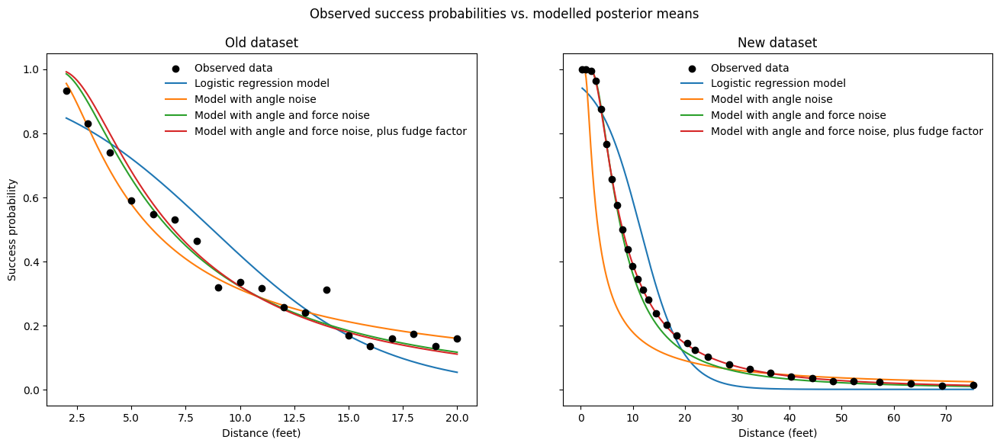
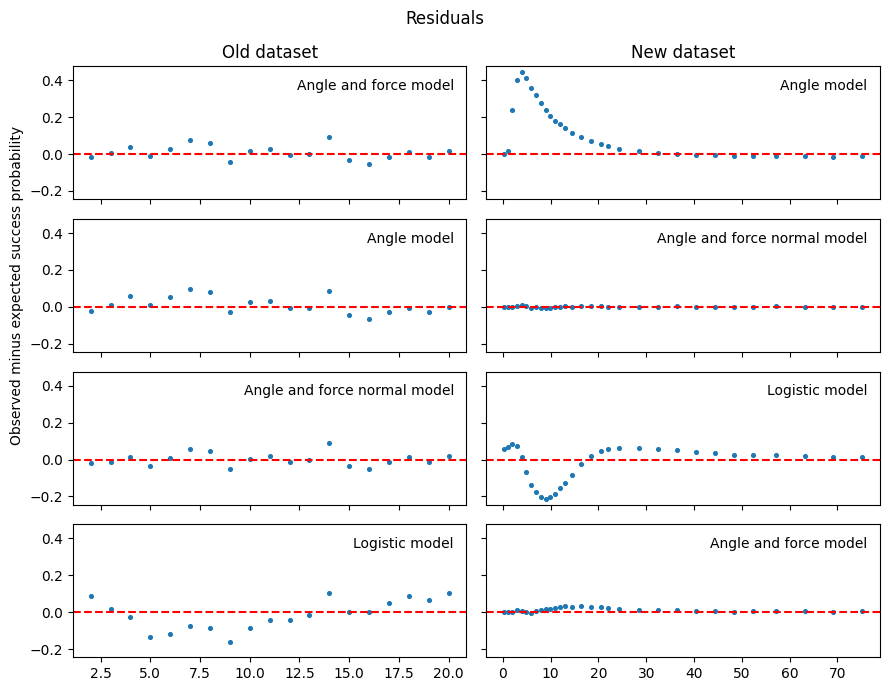

Putting
==============================

Statistical analysis of putting data, reproducing the analysis from
[here](https://statmodeling.stat.columbia.edu/2019/03/21/new-golf-putting-data-and-a-new-golf-putting-model/)
and [here](https://mc-stan.org/users/documentation/case-studies/golf.html) using
[cookiecutter-cmdstanpy-analysis](https://github.com/teddygroves/cookiecutter-cmdstanpy-analysis).





# How to install dependencies

Run this command from the project root:

```
pip install -r requirements.txt
install_cmdstan
```

# How to run the analysis

To run the analysis, run the command `make analysis` from the project root.

This will run the following commands

- `python prepare_data.py`
- `python sample.py`
- `jupyter execute investigate.ipynb`

# How to create a pdf report

First make sure you have installed [pandoc](https://pandoc.org).

Now run this command from the `docs` directory:

```
make report
```


# How to run tests

Run this command from the project root:

```
python -m pytest
```

